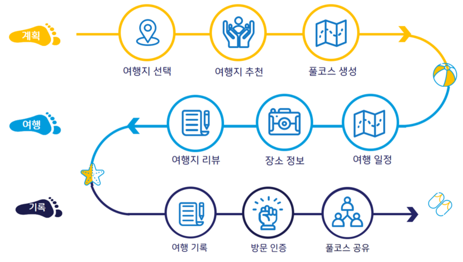
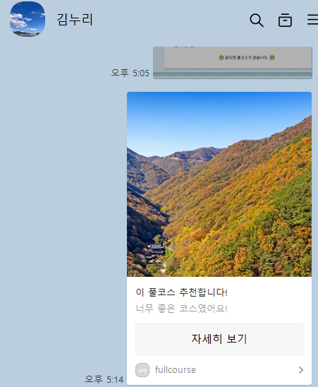
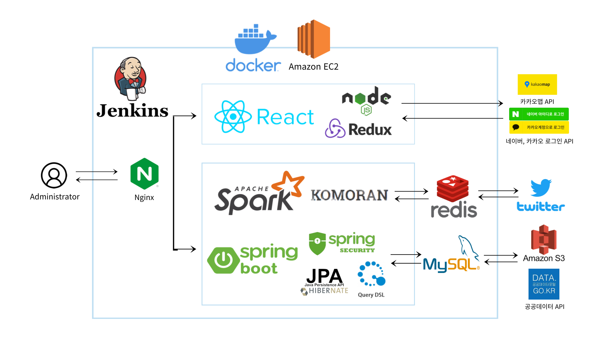
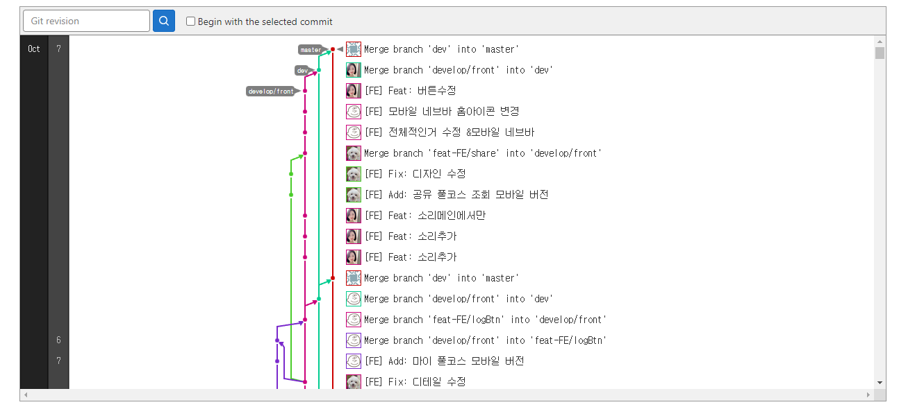
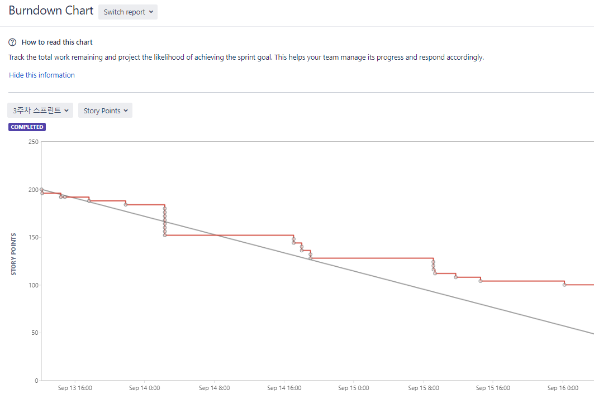
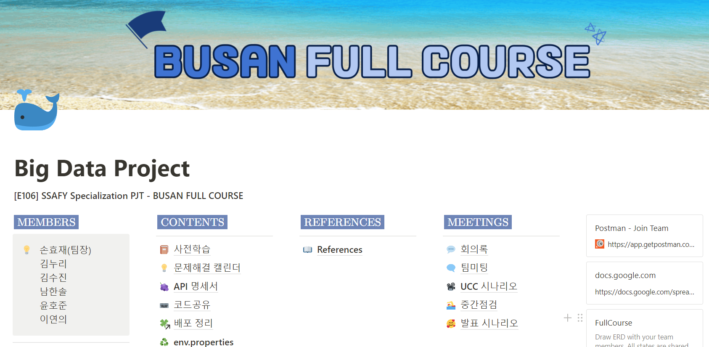
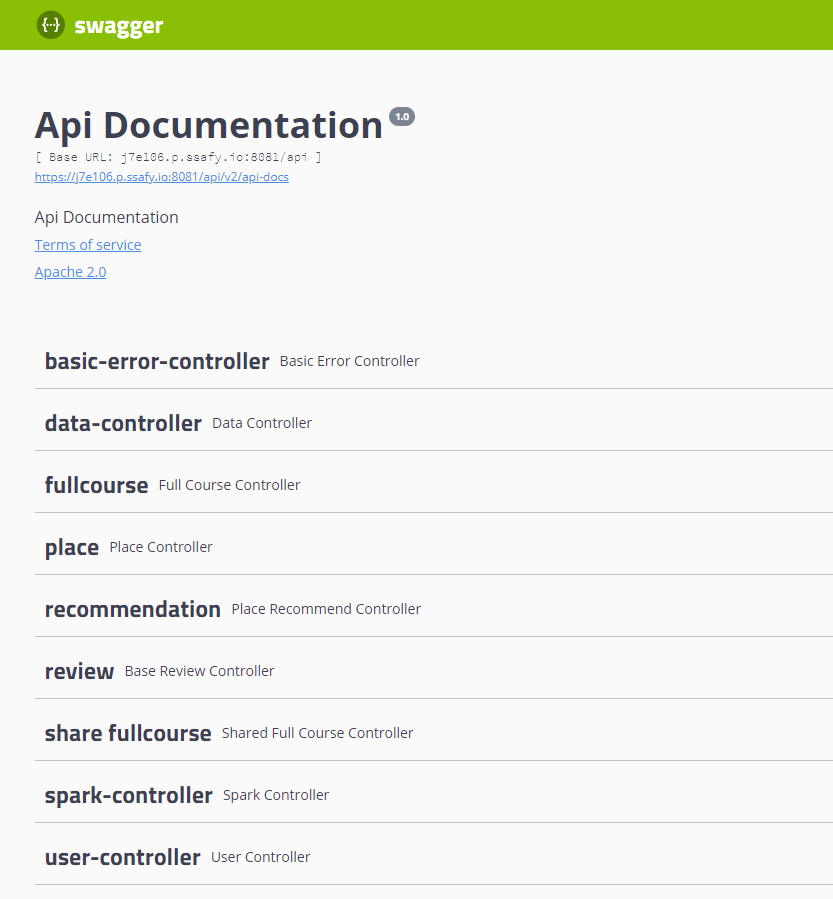
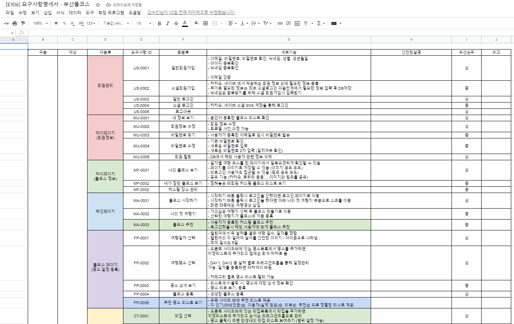
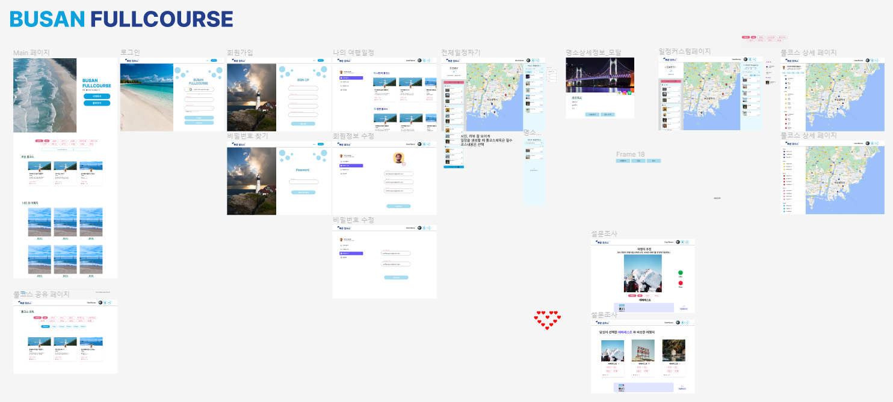
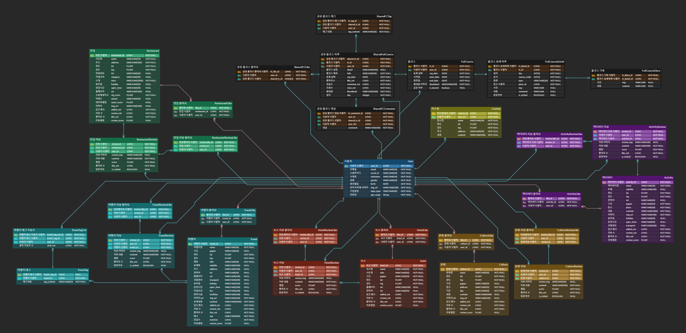

# FullCourse (맞춤 풀코스 추천 여행 플래너)

📆 **프로젝트 진행기간 : 2022/08/22 ~ 2022/10/07**

🤠 **FE: 김누리, 윤호준**

😼 **BE: 손효재 (팀장), 김수진, 남한솔, 이연의**

📽 **[프로젝트 UCC 영상 보러가기](https://www.youtube.com/watch?v=DfcWpjBElUs)**


## 👭 소개

### 부산이 처음인 당신을 위한, 맞춤 풀코스 추천 여행 플래너 <부산 풀코스>

#### 부산 풀코스 (FullCourse) 프로젝트는 부산 여행 계획 및 기록 서비스,

#### 그리고 일정 공유까지 하나의 웹에서 제공할 수 있는 서비스입니다.

#### 해시태그를 활용한 추천 서비스와 SNS데이터를 분산처리한 워드클라우드를 통해 부산의 다양한 정보를 제공합니다.

<br/>

## 🔬 주요 기능



- 장소 정보 제공 및 일자별 풀코스 생성

- 코사인 유사도를 활용한 추천 알고리즘을 활용해 사용자가 선택한 이미지와 유사한 장소를 추천

- 장소와 관련한 SNS 키워드를 분산처리하여 워드클라우드를 통해 시각화한 정보 제공

- 날짜 선택 후 일정 생성

- 숙소, 문화, 체험, 맛집, 여행지 컨텐츠를 거리, SNS언급수, 좋아요수, 검색 등 다중 필터링으로 조회 가능

- 컨텐츠 별 상세 정보 제공 및 리뷰 서비스 제공

- 드래그앤 드롭 방식으로 데일리 일정을 완성하고, 풀코스 생성 가능

- 생성한 풀코스 상세페이지에서는 카카오 맵 API, 구글 맵 API를 활용해 경로 및 위치 정보 제공

- 생성한 풀코스에는 여행 후 기록을 남길 수 있으며, 기록에 남겨진 사진의 위치정보를 분석해 위치가 일치할 시 방문인증 배지를 부여

<br/>

## 🔎 부산풀코스 서비스 화면

### 메인 화면


---

### 로그인 화면


---

### 추천 및 워드클라우드


---

### 일정짜기 화면


---

### 상세 풀코스 및 방문 인증


---

### 마이페이지 및 여행 후 공유


---

### 풀코스 검색 및 공유 풀코스 상세화면


### sns 공유 기능



### 반응형 구현


<br/>

## 🧰 개발 환경

#### OS: Windows 10

#### IDE

- IntelliJ 2021.3.2
- Visual Studio Code 1.70.1
- UI/UX: Figma

#### Database

- MySQL 8.0.30
- Redis 7.0.4
- Server: AWS EC2 Ubuntu 20.04 LTS

#### Dev-Ops

- Docker 20.10.18
- Jenkins 2.60.3
- Nginx - 1.18.0

### ⌨ Backend

- Spring boot 2.7.3
- Open JDK 8
- Gradle 7.5
- Querydsl 5.0
- Spark Project core 3.3.0
- Komoran 3.3.4

### 🖥 Frontend

- HTML5, CSS3, JavaScript(ES6)
- React 17.0.2
- redux 4.2.0
- redux-toolkit 1.8.3
- Node.js 16.14.0
- styled-components 5.3.5
- yarn 1.22.19
- React-wordcloud 1.2.7
- VSCode Extension
  - Prettier - Code formatter (Ver 9.5)
  - ES Lint (Ver 2.2.6)
  - Reactjs code snippets (Ver 2.4.0)

### 🔗 CI/CD

- Amazon EC2 - Ubuntu 20.04
- Nginx - 1.18.0
- docker - 20.10.17

<br/>

## 🧩 서비스 아키텍처



<br/>

## 🌈 기술 특이점

- 부산이라는 특정 지역을 한정하여, 정확한 정보 제공에 초점을 맞춤

- 기존의 여행 서비스와 차별점을 위해 리뷰의 신뢰도를 높이기 위한 방문 인증 제도 도입

- 코모란, 크롤링 활용 SNS 데이터 분산을 통해 워드 클라우드로 시각화 서비스 제공

- 코사인 유사도를 활용한 추천 알고리즘을 통해 이미지 유사도 기반의 추천을 제공

- 좋아요와 싫어요를 달아서 틱톡 형태의 추천 서비스로 사용자가 게임 하듯 추천 서비스를 받을 수 있게 구성

- 장소 장바구니와 드래그앤 드롭 형태의 일정짜기 UI/UX를 통해 여행 다이어리를 꾸미듯이 일정 생성 가능

- 일정 짜기 페이지 외에 모든 페이지 반응형 구현을 통해, 사용자가 생성한 풀코스 또는 공유한 풀코스 등을 조회함으로써 여행할 때 정보 제공 및 지도로 활용할 수 있음

<br/>

## 🤝🏻 협업 툴

- Gitlab

  

- Jira

  

- Notion

  - 공유: 개발을 하며 참고할 수 있는 레퍼런스, 사이트 링크 등을 모아 팀원들과 공유

  - 협업: 협업개발에 필요한 컨벤션, 프로젝트 일정 등 정리
  - 기록: 회의록, 팀미팅 피드백 등을 기록하며 프로젝트를 진행

  

- Figma

- Swagger

  

- Webex

- Google Sheet

<br/>

## 📋 요구사항 정의서



<br/>

## 💡 와이어프레임 및 스토리보드



<br/>

## ⚙ 컨벤션

### - [Git 컨벤션](https://pretty-headlight-d33.notion.site/GIT-Convention-92d6e08ed8874d668c6895a7ab3993d4)

### - [Backend 컨벤션](https://pretty-headlight-d33.notion.site/Backend-Convention-a443ea8a085646ae955271eaf4e7936f)

### - Frontend 컨벤션

```markdown
HTML, CSS - 변수, 함수, 인스턴스 : kebab-case - Indent : 2칸 스페이스바가 원칙
JavaScript - 변수, 함수, 인스턴스 : camelCase - Indent : 2칸 스페이스바가 원칙 - 상수는 대문자 SNAKE_CASE를 사용
```

### - Jira 컨벤션

```markdown
일정, 업무 관리 등 효율적인 협업을 위해 Jira를 활용하였습니다.
매주 월요일, 데일리 스크럼을 통해 한 주 동안 진행 해야 할 업무를 분류하고, 일주일 단위의 스프린트를 진행 하였습니다.

- Epic : 최상위 기능을 대제목과 소제목을 분류하여 Epic 작성
- Story : Epic의 하위 기능에 FE, BE 별로 구분하여 Story 작성
- Subtask : 각 기능을 구현하기 위한 개발 내역은 Subtask에 작성
```

<br/>

## 🖇 ERD


